# FLOW FREE SOLVER – ỨNG DỤNG MINH HỌA CÁC THUẬT TOÁN TÌM KIẾM TRÍ TUỆ NHÂN TẠO

## Thành viên thực hiện
| STT | Họ và tên                   | MSSV       |
|-----|-----------------------------|------------|
| 1   | Phan Kế Duy			        | 23110087   |
| 2   | Lê Nguyễn Đăng Khoa         | 23110115   |
| 3   | Phạm Nguyễn Đăng Khoa       | 23110117   |
---

## GIỚI THIỆU

**Flow Free Solver** là một ứng dụng minh họa trực quan các **thuật toán tìm kiếm trong Trí tuệ Nhân tạo (AI)** thông qua trò chơi **Flow Free**.

Trò chơi yêu cầu **nối các cặp điểm màu trên lưới** sao cho:
- Các đường **không giao nhau**.
- **Toàn bộ lưới được lấp đầy**.

Bài toán này thuộc lớp **NP-Hard**, có không gian trạng thái lớn, là minh chứng tuyệt vời để so sánh hiệu quả giữa các thuật toán tìm kiếm **Uninformed**, **Informed**, **Local Search** và **CSP**.

---

## NHÓM THUẬT TOÁN TRIỂN KHAI

### UNINFORMED SEARCH (TÌM KIẾM KHÔNG THÔNG TIN)
Các thuật toán không sử dụng thông tin về khoảng cách hay chi phí đến mục tiêu.

#### DFS (Depth-First Search)
- **Nguyên lý:** Đi sâu nhất có thể theo mỗi nhánh, dùng stack.  
- **Ưu điểm:** Bộ nhớ nhỏ, có thể tìm nghiệm nhanh nếu gần gốc.  
- **Nhược điểm:** Dễ kẹt trong vòng lặp, không đảm bảo đường ngắn nhất.

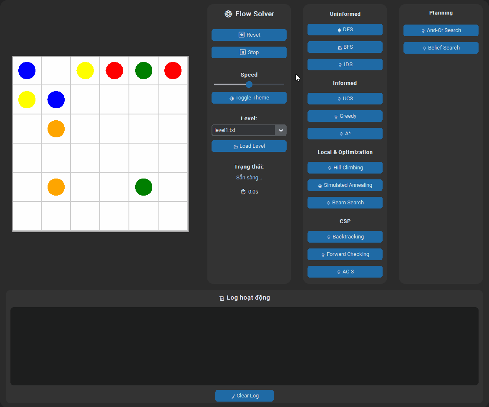

---

#### BFS (Breadth-First Search)
- **Nguyên lý:** Duyệt theo tầng, mở rộng tất cả node ở cùng độ sâu trước.  
- **Ưu điểm:** Luôn tìm được đường đi ngắn nhất.  
- **Nhược điểm:** Tốn bộ nhớ, khó mở rộng cho lưới lớn.


---

#### IDS (Iterative Deepening Search)
- **Nguyên lý:** Kết hợp BFS và DFS. Thực hiện DFS nhiều lần với giới hạn độ sâu tăng dần.  
- **Ưu điểm:** Giảm bộ nhớ so với BFS, vẫn đảm bảo tối ưu.  
- **Nhược điểm:** Tốn thời gian do lặp lại các tầng cũ.

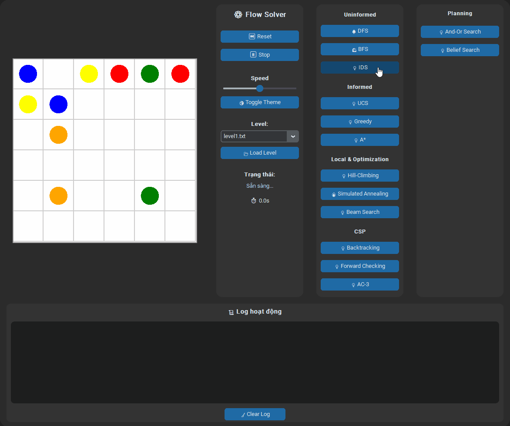

---

#### UCS (Uniform Cost Search)
- **Nguyên lý:** Mở rộng theo chi phí nhỏ nhất từ gốc (priority queue).  
- **Ưu điểm:** Luôn tìm được đường đi tối ưu nếu chi phí dương.  
- **Nhược điểm:** Chậm hơn BFS khi chi phí đồng đều.

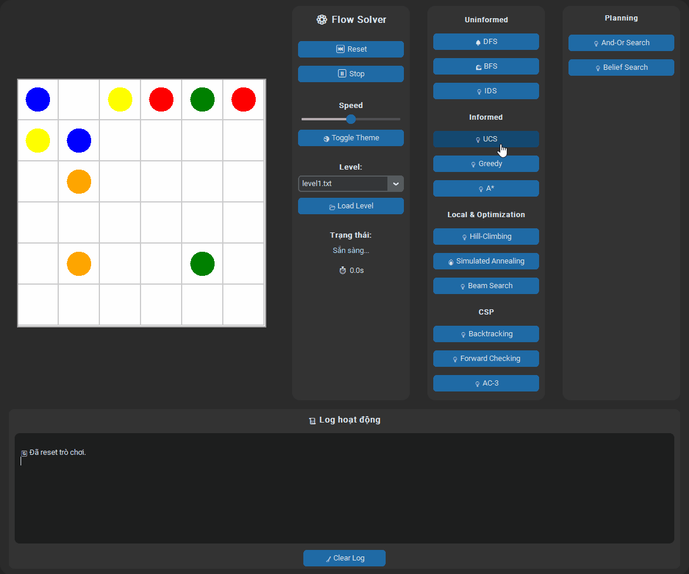

---

### INFORMED SEARCH (TÌM KIẾM CÓ THÔNG TIN)
Các thuật toán có sử dụng **hàm heuristic (h(n))** để ước lượng khoảng cách tới mục tiêu.

#### Greedy Search
- **Nguyên lý:** Luôn chọn node “gần đích nhất” theo heuristic.  
- **Ưu điểm:** Nhanh, ít bộ nhớ.  
- **Nhược điểm:** Dễ kẹt trong nghiệm cục bộ, không tối ưu toàn cục.

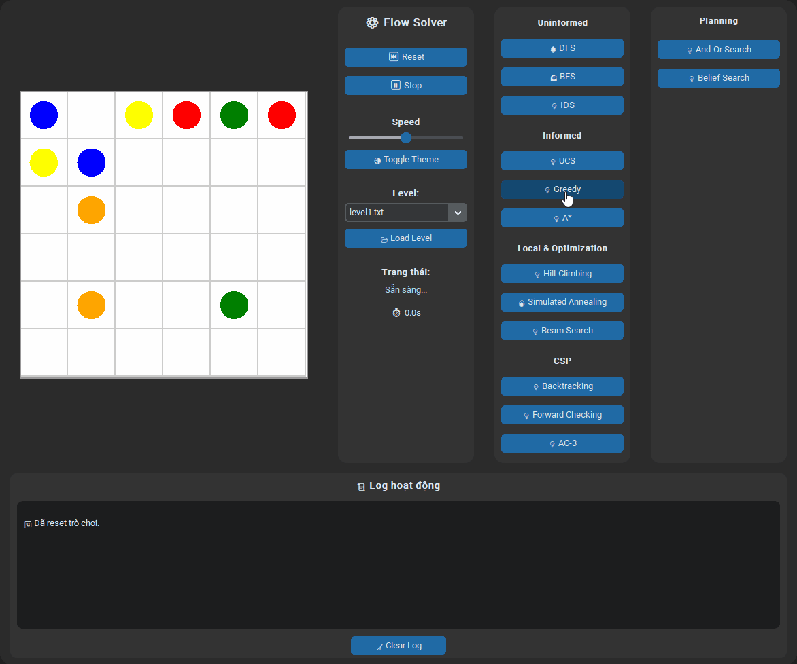

---

#### A* Search
- **Nguyên lý:** Kết hợp giữa UCS và Greedy với công thức `f(n) = g(n) + h(n)`.  
- **Ưu điểm:** Tìm được đường đi tối ưu toàn cục nếu `h(n)` phù hợp.  
- **Nhược điểm:** Tốn bộ nhớ vì phải lưu nhiều trạng thái.

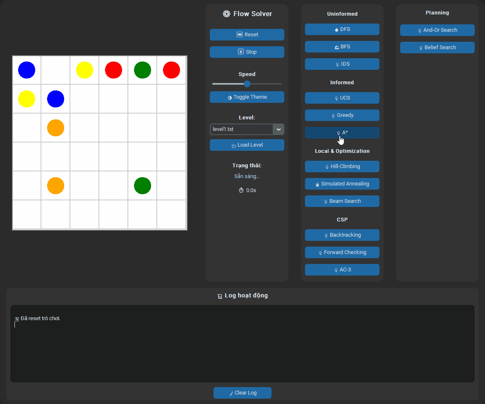

---

#### Beam Search
- **Nguyên lý:** Giữ lại tối đa `k` node “tốt nhất” ở mỗi tầng.  
- **Ưu điểm:** Tối ưu hóa tốc độ, giảm bộ nhớ.  
- **Nhược điểm:** Có thể bỏ lỡ nghiệm do giới hạn beam width.

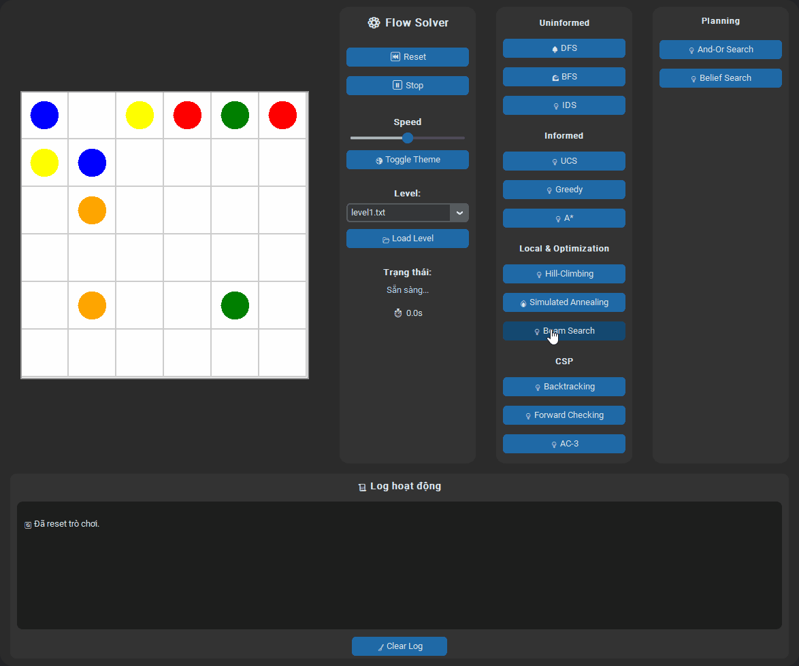

---

### LOCAL SEARCH & OPTIMIZATION (TÌM KIẾM CẢI TIẾN DẦN)

#### Hill Climbing
- **Nguyên lý:** Chọn bước đi tốt hơn liên tục cho đến khi không thể cải thiện.  
- **Ưu điểm:** Đơn giản, nhanh.  
- **Nhược điểm:** Dễ mắc kẹt ở cực trị cục bộ.

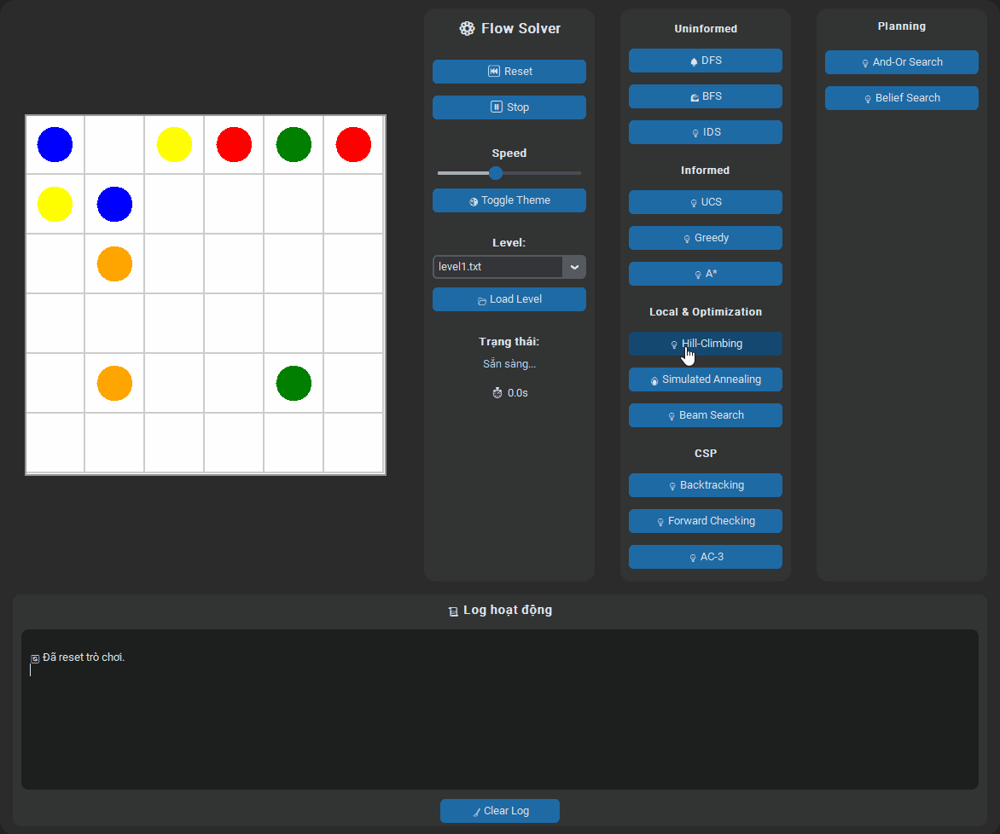

---

#### Simulated Annealing
- **Nguyên lý:** Cho phép “lùi bước” ngẫu nhiên theo nhiệt độ T để thoát cực trị cục bộ.  
- **Ưu điểm:** Cải thiện Hill Climbing, có khả năng tìm nghiệm tốt hơn.  
- **Nhược điểm:** Cần tinh chỉnh thông số T và α.


---

### CONSTRAINT SATISFACTION PROBLEM (CSP)

#### Backtracking
- **Nguyên lý:** Gán từng biến màu, nếu sai thì quay lui (backtrack).  
- **Ưu điểm:** Dễ hiểu, giải được nhiều loại ràng buộc.  
- **Nhược điểm:** Tốc độ chậm với lưới lớn.

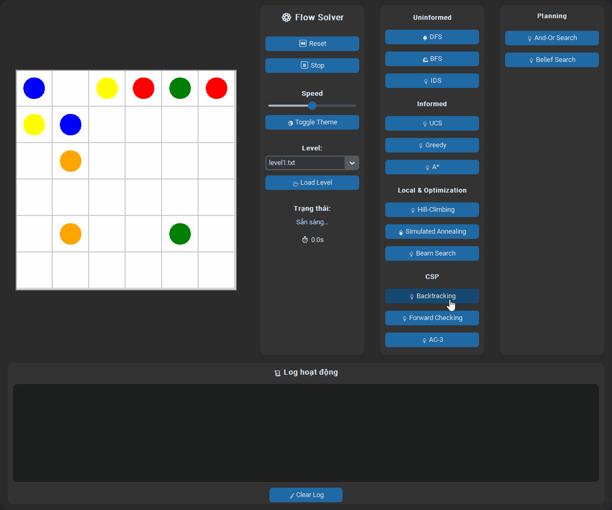

---

#### Forward Checking
- **Nguyên lý:** Rút gọn miền giá trị của các biến còn lại sau mỗi bước gán.  
- **Ưu điểm:** Tránh sai sớm, hiệu quả hơn Backtracking thường.  
- **Nhược điểm:** Tốn thêm bộ nhớ để duy trì domain.


---

#### AC-3 (Arc Consistency)
- **Nguyên lý:** Lan truyền ràng buộc giữa các biến, loại bỏ giá trị không hợp lệ.  
- **Ưu điểm:** Giảm đáng kể số bước thử sai.  
- **Nhược điểm:** Không đảm bảo tìm được nghiệm nếu ràng buộc phức tạp.

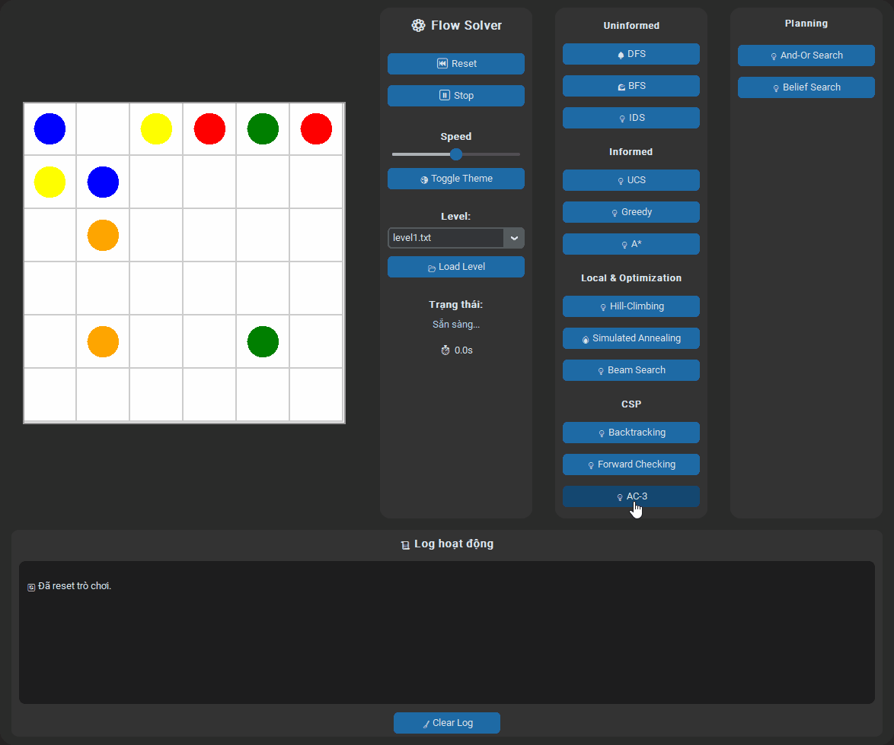

---

### PLANNING & LOGIC

#### And-Or Search
- **Nguyên lý:** Mô hình hóa bài toán có nhiều nhánh lựa chọn và phụ thuộc logic.  
- **Ưu điểm:** Tìm lời giải trong các bài toán lập kế hoạch phân nhánh.  
- **Nhược điểm:** Khó biểu diễn và trực quan hóa.

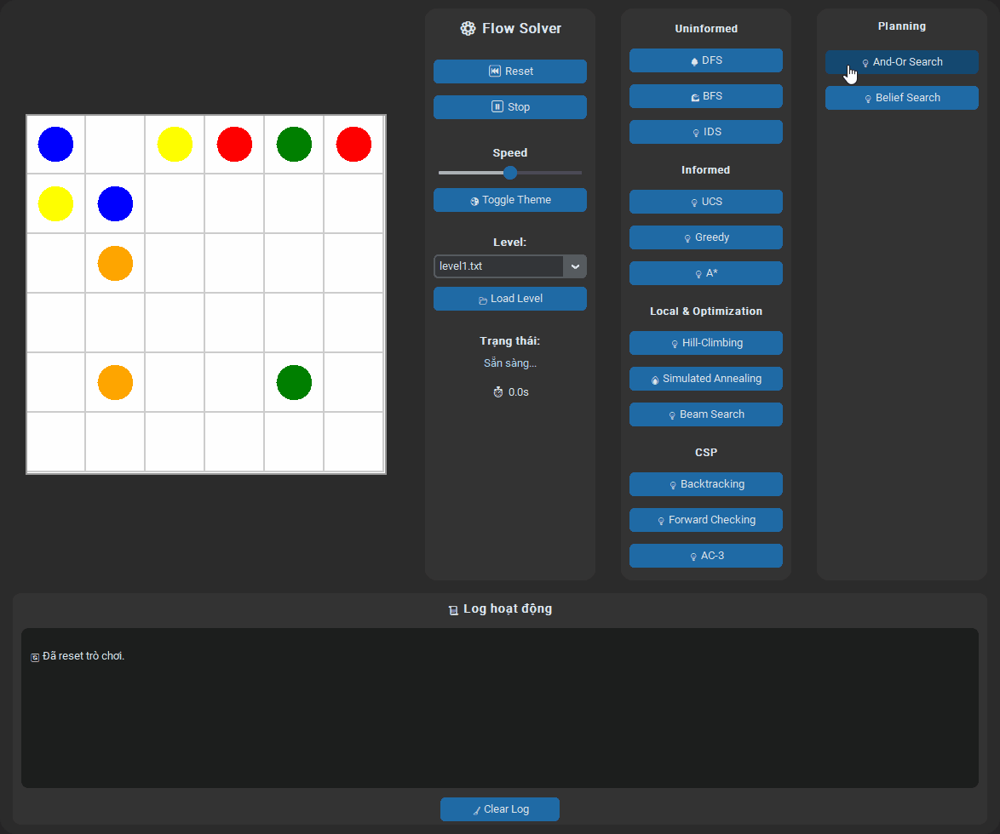

---

#### Belief Search
- **Nguyên lý:** Tìm kiếm trong môi trường quan sát không đầy đủ.  
- **Ưu điểm:** Dùng cho bài toán có tính ngẫu nhiên hoặc ẩn thông tin.  
- **Nhược điểm:** Tính toán phức tạp, khó mở rộng.

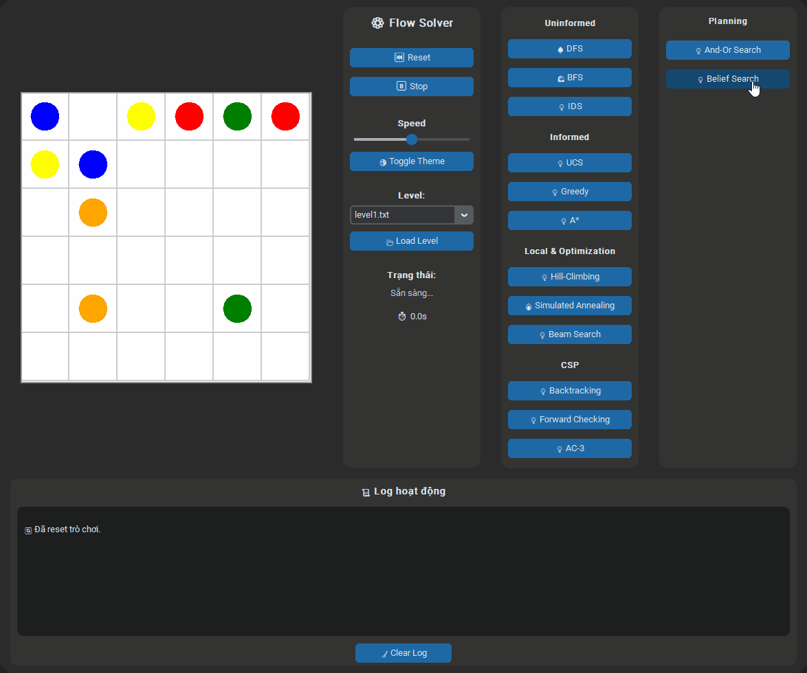

---

## CÔNG NGHỆ SỬ DỤNG

| Thành phần | Mô tả |
|-------------|--------|
| **Ngôn ngữ** | Python 3.10+ |
| **Giao diện** | customtkinter, tkinter |
| **Xử lý thuật toán** | heapq, math, random, deque, copy |
| **Phát triển trên** | PyCharm / VSCode |
| **Cài đặt** | `pip install -r requirements.txt` |

---

## CÁCH CHẠY CHƯƠNG TRÌNH

```bash
python main_ff.py
```
## Cấu trúc dự án
```
Du-an-cuoi-ki-AI
│
├── algorithm_ff.py       # Thuật toán tìm kiếm
├── UI_ff.py              # Giao diện (GUI)
├── main_ff.py            # Điểm khởi chạy
├── requirements.txt      # Thư viện cần cài
├── levels/               # Các màn chơi (tùy chọn)
├── gif            		  # Các file GIF minh họa
└── README.md             # File mô tả dự án